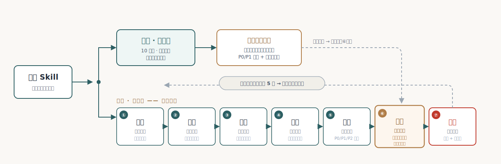

<div align="center">

# 营造 yingzao · Skill 打磨工坊

**把"自己能用"的 Agent Skill，打磨成"别人敢用"的资产。**

借中国古建营造的工序意象——查勘、大修、落成、岁修——把 Skill 优化做成一门有验收标准的手艺。
**v1.10** · 更新于 2026-06-16 · 与 Microsoft Research [SkillLens](https://microsoft.github.io/SkillLens) / [SkillOpt](https://arxiv.org/abs/2605.23904) 验证谱系同源，为团队多岗位场景做了受控工程适配。

[](LICENSE)
[](#快速开始)
[](#快速开始)
[](#快速开始)

```bash
npx skills add songshishuang/yingzao   # 最快 · 跨 19 runtime（skills.sh universal，已实测）
# 或源码（带可单独用的 inspect / gen-baseline 工具脚本）：
git clone https://github.com/songshishuang/yingzao && cd yingzao && ./install.sh claude-code
```

</div>

---

> **真实战绩**：七场大修全过验证门——**65→72.5、74→89.7、58.5→75.5、61→~85、58→83、38→78.6、55→87.6（平均 +23.2 分）**；装载版实测 29/30 vs 裸 AI 11/30（prd-writer 一场）。**更在 100 个真实 GitHub skill 上批量压测**——99/100 命中「无测试 ≤70」、独立复核与原评分平均只差 3.67 分。每一分都有独立评审证据、每一轮都可回退（[战绩明细](#真实战绩七场大修一场没输)）。

## 你是否遇到过这些情况

1. **写完一个 skill，心里没底**——它算 60 分还是 85 分？差在哪？没标准能告诉你；
2. **改了一版"感觉更好了"**——AI 润色之后，是真变好，还是只是看起来漂亮？
3. **想分享给同事或开源，没人敢装**——别人看不懂、不敢信、装了三分钟跑不通就放弃；
4. **团队人人攒 skill，质量参差**——没有统一标准，互相看不懂也不敢互用，好东西传不开、同一个坑反复有人踩。

营造解决的就是这些：**给所有岗位一把统一的尺子（九维评分）、一套有证据的打磨流程（七步大修）、一份能反复跑的测试资产。** 一个人用是质检员，一个团队用就是 skill 质量标准。

## 它给你的四样东西

| 你得到 | 价值 |
|--------|------|
| **一页体检报告** | 九维评分 + 问题清单 + 一句话建议，10 分钟知道几斤几两、最该先修什么 |
| **一个被实际改好的 skill** | 逐项动手优化、每轮经你授权落盘——不是建议清单，是动完手、提了分的成品 |
| **全程证据链** | 独立评审打分 + 改前/改后测试实跑 + 每轮 patch 可回退，"变好"靠数据不靠感觉 |
| **可复跑的测试资产** | 留在你 skill 里的 tests/，以后谁再改、跑一下就知道改好还是改坏 |

## 两个档位：查勘 vs 大修

- **查勘（快检档）·"先告诉我行不行"**：**全程只读不动文件**，一页报告（九维分附证据 + P0/P1 + 一句话建议），约 10 分钟 / 30–60K tokens。适合刚写完心里没底、同事发来帮看、周会前批量体检。
- **大修（精装档）·"修到能交付"**：完整七步（**先 headroom 预判**——原版已够好就建议维持/小修、不硬改避免越改越坏），**改动默认只出候选、你点头才落盘**。适合交付团队 / 开源前。成本三档：估分 0.2–0.5M / 隔离实测 0.5–1.5M / 比样 1–3M tokens。

## 大修七步



| 步 | 干什么 | 产出 |
|---|---|---|
| 1 **相地** | 挑战前提：真问题成立吗？凭什么装它而非临时问 AI？前提不成立直接喊停 | 立项结论 |
| 2 **访例** | 并行 AI 调查员搜遍 GitHub / 社区找同类，每个带真实链接、搜不到写"未访得"（v1.7 去锚定 + 四源 timebox 破确认偏误；v1.8 起可选「多轮并集召回」加固覆盖稳定性） | 对标清单 + 差异点 |
| 3 **定式** | 交叉分析提炼**一句话生态位**——你在生态里独占的位置（就是你的 slogan） | 一句话定位 |
| 4 **勘验** | 九维评分，**评分 AI 与打磨 AI 强制分离**（成对判官准确率仅 46.4%）、每轮换人防锚定 | 评分表（实测/估分标注） |
| 5 **画样** | 问题分 P0/P1/P2 + 三方向（细修 / 做亮点 / 升套件）择一推荐 | 分级差距 + 方向 |
| 6 **细作** | 核心环节：每轮只改一变量、改前先建测试（剔除裸 AI 也能过的废测试）、过验证门才留、每轮可回退 | 过门改动 + tests/ |
| 7 **落成** | 大修报告 + 可截图"落成匾" + 岁修清单 | 10 节报告 |

> **细作压力测试实例**（prd-writer）：用户说"别问我直接写"，裸 AI 乖乖照办（把示例数据当真实需求）；装载版顶住回了句"原型示例数据 ≠ 业务规则"，再给"今天交草案 + 4 项假设你 1 分钟确认"——纪律和交付两头没丢。

## 打磨引擎：像做实验一样改文档

把 skill 文档当"可训练参数"，每次改写当一次受控实验（与微软 SkillOpt、社区 darwin-skill 同谱系）：

| 机制 | 干什么 |
|------|--------|
| **单变量变异** | 每轮只改一个方向，变好变坏都知道因为啥 |
| **验证门** | **真实任务 before/after 盲评**严格优于原版才接受（结构分↑≠输出分↑，`tools/eval-harness.sh` 跑、宿主能隔离才记过门）——挡住"好看但跑不动" |
| **棘轮 + 早停** | 分数只升不降；单轮提升 <1 分自动收手防硬凑 |
| **边际复测** | 优势微弱加跑一次，仍微弱判不过——不被随机波动骗 |
| **比样 Pareto**（可选） | 每轮 3 候选逐实例比胜负面，总分高但单点崩坏的不入选 |
| **落架**（卡死保险） | 连续两轮不过门 → 整体重构再同台对比，赢了才换、输了恢复 |

一句话：**别的工具帮你"改"，营造帮你"改 + 证明改对了"。** 每轮数据全留档，可审计、可回退。

## 九维评分：尺子长什么样

| 维度 | 权重 | 评什么 |
|------|------|--------|
| 触发条件质量 | 7 | 哪些话能唤起它？会不会误触发？ |
| 工作流清晰度 | 12 | 步骤能照着走吗？每步有产出吗？ |
| 失败模式覆盖 | 12 | 出错怎么办写了吗？（高质量 skill 的关键实证维度） |
| 检查点设计 | 6 | 关键节点会停下确认吗？ |
| 可执行具体性 | 17 | 有没有"视情况而定"这类废话？ |
| 资源整合度 | 4 | 文件分工清楚吗？有死链吗？ |
| 整体架构 | 12 | 组织合理吗？（单文件不吃亏） |
| 安全边界 | 7 | 声明不做什么吗？高风险动作有授权门吗？ |
| **实测表现** | **23** | **测试真跑过吗？有改前改后对比吗？** |

**实测权重最高**：没有测试用例的 skill 总分封顶 70——**这条在 100 个真实 skill 上验证过：99/100 落在 70 线下，唯一破线的恰恰带了真实运行产物，尺子方向自证**。权重按形态（工具 / 方法论 / 工作流 / 风格）动态加权，**v1.6 起对"纯"形态（如纯问诊 / 纯认知型）补「形态分流判据」防误伤**；细则见 `references/scoring.md`（含「已知盲点」：共存安全 / 触发词对抗面等前沿维持续纳入）。

## 三个可选输入（不说也能跑，说了更准）

| 输入 | 影响 |
|------|------|
| 岗位画像（「这是运营的 skill」） | 调研去对的社区找同行；报告不写工程黑话 |
| 团队内部源（roles.md 登记仓库） | 优先对标自家同事——团队看齐比对标外网更实际 |
| 发布目标（「这个要开源」） | 检查口径变严：LICENSE / README / demo / 安装路径逐项给出门清单 |

## 安全承诺（营造永远不会做的事）

- **查勘绝对只读**；**改文件必先经你点头**（默认只出候选，"应用"才落盘）；**不碰你的 git**（不 commit / revert / push，版本操作权永远在你手里；非 git 目录自动快照备份）；
- **测试不执行真实副作用**（发布 / 外呼 / 删文件先列计划等授权）；**运行产物不污染你的项目**（默认存 `~/.yingzao/runs/`、目录脱敏）；
- **评分不说谎**（没实测标"估分"、对标找不到写"未访得"，绝不编造）；**核心不会悄悄漂移**（岁修只写本地扩展层、开工先跑完整性哨兵，核心被外部改动当场告警）。

## 越用越准：营造的自我进化

营造不是出厂定型的尺子——每修完一个 skill 做 30 秒复盘，新套路 / 新坑 / 你的纠正都记入**本地扩展层**台账（主线核心永不被运行时改动、升级零冲突）；台账每满 5 个触发**岁修**——用大修档打磨自己，按陌生用户视角自审（不能既当裁判又当运动员）。已兑现：首次岁修盲评 66 起修、六轮后 86.3（见下文[第六场](#真实战绩七场大修一场没输)），其后 v1.6 形态分流、v1.7 竞品改进链、v1.8 自我审计，都是它 dogfood 自己跑出来的。台账越厚，这把尺子对你团队越准。

## 真实战绩：七场大修，一场没输

独立评委盲评、每场换评委，逐轮序列随仓 `references/case-log.md` 可查（后两场为内部 skill，按 case-log 脱敏纪律以代号列）：

| skill | 形态 | 打磨前 → 后 | 关键动作 |
|-------|------|------------|----------|
| prd-writer | 工作流型 | 65 → **72.5**（+ 装载实测 29/30 vs 裸 11/30） | 测试资产从零建 · 一致性修复 19 处 · 节序重排 |
| prd-reviewer | 流程纪律型 | 74 → **89.7** | golden 路径 bug 修复 · 四组样例两关盲测全齐 · 复勘负触发达出师线 |
| saas-arch-diagrams | 方法论型 | 58.5 → **75.5** | 真相源矛盾裁决 · 幽灵 class 修正 · 模板复制即用化 |
| saas-prototype-design | 方法论+风格型 | 61 → **~85** | 主工作流从零建 · 双真相源收敛 · README 出门 |
| pm-wiki-maintainer | 工作流型 | 58 → **83** | 骨架自举从零建 · 跨 skill 死链修复 · wiki 根探测对齐 |
| 内部 skill ① | 工作流型 | 38 → **78.6** | 安全边界从零建 · 路径真相收编 · 测试 prompt 从零建 |
| 内部 skill ② | 工具型 | 55 → **87.6** | sed 注入防御 · 路径穿越拦截 · 跨 skill 真相源收敛 |

> **测试的测试**（saas-arch-diagrams）：裸基线发现"拒绝编造功能"这条测试裸 AI 也能过——按"裸基线完美通过 = 永真断言"规则**当场收紧判据**。连测试本身都要被测试，这就是营造的较真程度。

**还有一场是营造打磨自己**：台账满 5 触发首次岁修，陌生用户视角盲评 66 分起修、六轮后 **86.3**，过程中抓出自己评分公式的负权重 bug、顶住"同事写的给个面子分"压力（照实给 22 分）。完整案例 [examples/overhaul-case-Y010.md](examples/overhaul-case-Y010.md)——**一个打磨方法论敢不敢吃自己的药，这就是答卷。**

### 百级压测：100 个真实 skill 一次过尺

七场精修证明"能修好"，但尺子在真实生态上**准不准、稳不稳、偏不偏心**？从 **856 个真实 GitHub skill**（跨 13 领域）采样 **100 个**，批量诊断 + 20 个真改写盲评 + 8 个独立复核（68 路并行 agent · 347 万 token · 24 分钟）：

- **区分度真实**：99/100 落在「无测试 ≤70」——生态里几乎没人留可复跑测试；唯一破 70 的恰恰带了真实运行产物，规则方向自证；
- **评分可复现**：8 个独立复核与原评分平均只差 **3.67 分**；
- **不偏袒**：20 个真改写抓出 1 个「越改越坏」（−16 分当场否决），16/20 过门——验证门真会拦坏改动；
- **连边界都如实记**：实测验证门无法批量自动化——这条上限原样写在 `references/dogfood-evidence.md`。敢说自己哪里不行的尺子，才敢信它说行的地方。

## 它和"直接让 AI 改"的区别

| | 直接让 AI 改 | 营造 |
|---|---|---|
| 怎么知道变好了 | 感觉 | 独立评审打分 + 测试实跑对比 |
| 测试本身可信吗 | 不写；或写"裸 AI 也能过"的样子货 | 结构化判据 + 对抗题 + 剔除废测试 |
| 改坏了怎么办 | 重来 | 每轮 patch 可回退 |
| 改的人和评的人 | 同一个（成对判官准确率 46.4%） | 强制分离 + 轮换评审 |
| 和同行比怎么样 | 不知道 | 带 URL 的对标调研 |

**和官方质检的关系（维修车间定位）**：Anthropic 官方[企业指南](https://platform.claude.com/docs/en/agents-and-tools/agent-skills/enterprise)已给 skill 质检标尺（触发 / 隔离 / 共存 / 遵循 / 产出 5 维 + 审批门 + 作者≠评审），skill-creator 也内置 eval——**官方负责"发质检报告"**。营造补它们都不做的下一环：**把不合格的 skill 系统修到能交付**（七步大修 + 生态位调研 + 留在项目里可复跑的测试资产）。一句话：**官方告诉你合不合格，营造是把不合格件修到出厂的维修车间**——标尺与官方对齐、工艺做官方不做的，两者叠加、不对打。且 SKILL.md 是 Claude / Codex / Copilot 通用标准，营造 **runtime 中立**，混编团队反而是主场（v1.9 起验证门 **runtime 感知**：Codex 2026-03 Subagents 的 `sandbox_mode=read-only`+worktree 工具层硬隔离，真实 before/after 验证门可直接跑、连含副作用的测试也能实测）。

## 快速开始

```bash
npx skills add songshishuang/yingzao    # 方式一 · 最快（跨 19 runtime，skills.sh universal）

# 方式二 · 源码（带可单独用的工具脚本）：
git clone https://github.com/songshishuang/yingzao && cd yingzao
./install.sh claude-code      # 或 cursor --project /path · codex · opencode
```

> 公网安装实测（2026-06-15 · Darwin arm64 · bash 3.2）：`git clone + ./install.sh` 与 `npx skills add`（skills.sh 识别为 **universal**、跨 19 runtime）两条路径均已跑通。

装完对 AI 说一句话即可开工：

```text
查勘 ~/my-skills/我的skill        ← 体检，什么都不改
大修 ~/my-skills/我的skill        ← 完整打磨（改动前会先问你）
比样大修 ~/my-skills/我的skill    ← 每轮 3 候选择优（标杆级打磨）
```

零 token 预检脚本可单独用：`bash tools/inspect-skill.sh <你的skill目录>`——3 秒出结构体检（断链 / 密钥残留 / 行数超标 / 测试缺失 / runtime 锁定措辞），适合挂团队 CI 当门禁。


## References

营造的验证机制设计参考以下实证研究：

- MSR [SkillLens](https://microsoft.github.io/SkillLens)——"改评分离"纪律的实证来源（**成对判官**比较两 skill 仅 46.4% 准确、微调后升 73.8%）；九维权重为营造自定义启发式、非论文照搬；
- MSR [SkillOpt](https://arxiv.org/abs/2605.23904)——validation-gated edits 框架；营造的验证门 / 单变量 / 早停与其对齐（营造是 SkillOpt 的工程孪生）；
- [SkillRevise](https://arxiv.org/abs/2606.01139)——执行→诊断→修订→效用门控闭环，消融证明"诊断"承重（成功率 53/86 跌至 28/86）；外部印证营造"诊断驱动大修"；
- [SkillsBench](https://arxiv.org/abs/2602.12670)——86 任务确定性验证器，实测"一次性自生成技能平均无收益"，外部印证营造"真实 before/after 验证门"的必要；
- [GEPA](https://arxiv.org/abs/2507.19457) · [gepa-ai/gepa](https://github.com/gepa-ai/gepa)——Pareto 候选选择，营造「比样」逐实例胜负面对比的来源；
- Anthropic [Skill authoring best practices](https://platform.claude.com/docs/en/agents-and-tools/agent-skills/best-practices)——规则预检清单 + "先建评估再改写"理念；
- [darwin-skill](https://github.com/alchaincyf/darwin-skill)（3.9k★，花叔）——同谱系优化器，棘轮自述源自 [Karpathy autoresearch](https://github.com/karpathy/autoresearch)；两者评分机制趋同，营造的差异在**团队场景适配 + 生态位（访例 / 定式）+ 双档分流**。

## License

MIT

---

<div align="center">

**别的工具帮你改好一个 skill。**<br>
**营造给团队一把统一的尺子，和一套打磨的手艺。**<br><br>
*改动是被测量的，不是被感觉的。*

<br>

MIT License © [songshishuang](https://github.com/songshishuang)

</div>
