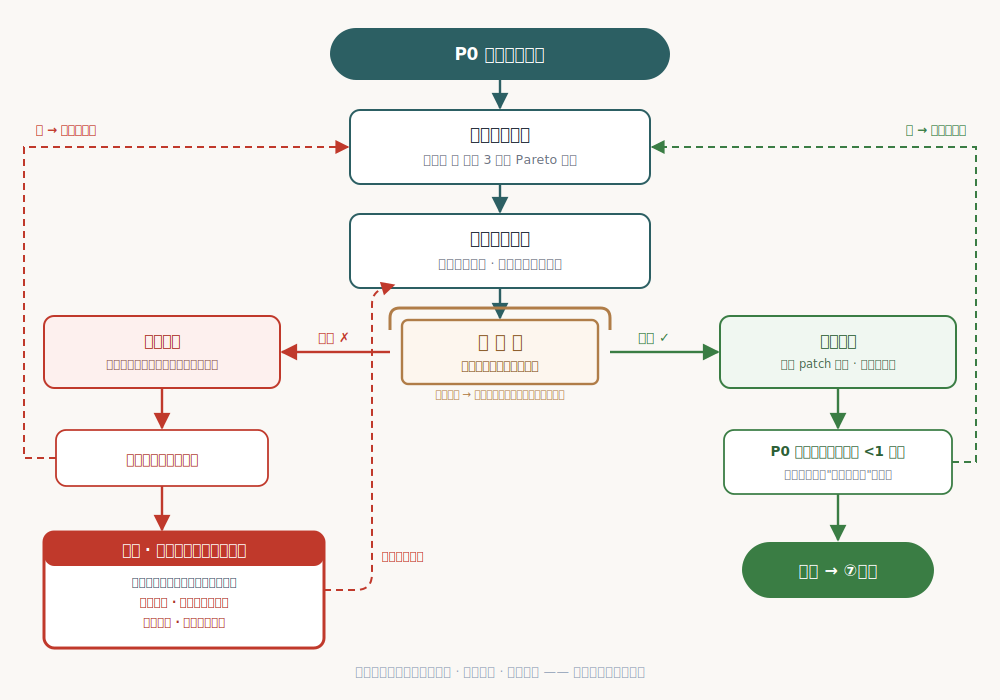
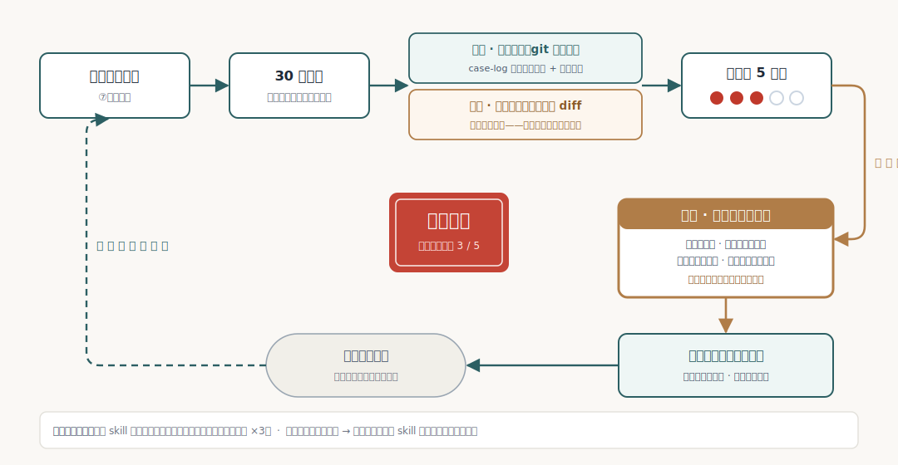

<div align="center">

# 营造 yingzao · Skill 打磨工坊

**把"自己能用"的 Agent Skill，打磨成"别人敢用"的资产。**

借中国古建营造的工序意象——查勘、大修、落成、岁修——把 Skill 优化做成一门有验收标准的手艺。
**v1.8** · 更新于 2026-06-15 · 与 Microsoft Research [SkillLens](https://arxiv.org/abs/2605.23899) / [SkillOpt](https://arxiv.org/abs/2605.23904) 验证谱系同源，为团队多岗位场景做了受控工程适配。

[](LICENSE)
[](#快速开始)
[](#快速开始)
[](#快速开始)

```bash
# 最快 · 跨 19 runtime（skills.sh universal，已实测）
npx skills add songshishuang/yingzao
# 或源码安装（含可单独用的 inspect/gen-baseline 等工具脚本）
git clone https://github.com/songshishuang/yingzao && cd yingzao && ./install.sh claude-code
```

</div>

---

> **真实战绩**：五场大修全过验证门——**65→72.5、74→89.7、58.5→75.5、61→~85、58→83（平均 +17.8 分）**；装载版实测 29/30 vs 裸 AI 11/30（prd-writer 一场）。**更在 100 个真实 GitHub skill 上批量压测过这把尺子**——99/100 命中「无测试 ≤70」、8 个独立复核与原评分平均只差 3.67 分。每一分都有独立评审证据（逐轮序列随仓可查：`references/case-log.md`），每一轮都可回退。（[五场明细 + 百级压测](#真实战绩五场大修一场没输)见下文）

## 你是否遇到过这些情况

1. **写完一个 skill，心里没底**——它到底算 60 分还是 85 分？差在哪？没有任何标准能告诉你；
2. **改了一版"感觉更好了"，其实不知道**——AI 帮你润色之后，到底是真变好，还是只是看起来更漂亮？
3. **想把 skill 分享给同事或开源，没人敢装**——别人看不懂、不敢信、装了三分钟跑不通就放弃了；
4. **团队里人人都在攒 skill，质量参差不齐**——PM、研发、运营各写各的，没有统一标准，互相看不懂也不敢互用，好东西传不开、同一个坑反复有人踩；接手同事或网上的 skill，靠肉眼根本判断不了能不能信。

营造解决的就是这些事：**给所有岗位的 skill 一把统一的尺子（九维评分），一套有证据的打磨流程（七步大修），和一份能反复使用的测试资产（改没改好，跑一下就知道）。** 一个人用，它是你的质检员；一个团队用，它就是团队的 skill 质量标准。

## 它给你的四样东西

| 你得到 | 形式 | 价值 |
|--------|------|------|
| **一页体检报告** | 九维评分 + 问题清单 + 一句话建议 | 10 分钟知道自己的 skill 几斤几两、最该先修什么 |
| **一个被实际改好的 skill** | 按差距清单逐项动手优化——修断链、清矛盾、补测试、优化触发词、重排结构……每轮改动经你授权落盘 | **不是一份建议清单，是动完手、提了分的成品**（五场实战平均 +17.8 分，见下文战绩） |
| **全程证据链** | 独立评审打分 + 改前/改后测试实跑对比 + 每轮 patch 可回退 | "变好了"不靠感觉，靠数据；改坏了随时退回任意一轮 |
| **可复跑的测试资产** | 留在你 skill 里的 tests/ 目录 | 以后任何人（包括 AI）再改这个 skill，跑一下测试就知道改好还是改坏 |

## 两个档位：查勘 vs 大修

### 查勘（快检档）——"先告诉我行不行"

- **什么时候用**：自己刚写完心里没底 / 同事发来一个 skill 帮看看 / 周会前批量体检团队资产
- **承诺**：**全程只读，不动你任何文件**
- **产出**：一页报告——九维分数（每个分数附证据，精确到文件行号）+ 必须改/应该改清单 + 一句话最优先建议（[样例报告](examples/sample-quick-report.md)）
- **成本**：约 10 分钟 / 30-60K tokens

### 大修（精装档）——"帮我修到能交付"

完整七步流程（下节逐一说明），每一步都有明确产出；**所有对你文件的改动，默认只生成候选方案，你点头才落盘**。

- **什么时候用**：skill 要交付团队 / 准备开源 / 查勘后想认真修一轮
- **成本**：按运行深度分三档——估分档 0.2-0.5M tokens；隔离实测档 0.5-1.5M；多候选比样档 1-3M

## 大修七步，每一步在为你做什么


### 第 1 步 · 相地（立项审查）
**干什么**：先挑战前提——这个 skill 解决的问题真实存在吗？它的独特性是方法论、私有经验，还是工作流？用户凭什么安装它而不是临时问 AI？
**对你的价值**：避免在不值得修的东西上花钱。如果前提不成立，营造会直接停下来告诉你"建议换个方向"，而不是硬着头皮帮你润色。
**产出**：立项结论 + 独特性来源判定。

### 第 2 步 · 访例（同类调研）
**干什么**：派出并行 AI 调查员，搜遍 GitHub 和社区找同类 skill——谁跟你做的像？他们凭什么被安装、被收藏？你有而他们没有的是什么？**每个对标都必须带真实链接，搜不到就如实写"未访得"，绝不编造。**
**对你的价值**：你的 skill 不是在真空里——知道同行什么水平，才知道自己该往哪打。
**产出**：对标清单（全带 URL）+ 差异点分析。
> 真实案例：给 prd-writer 做访例时核查了 **32 个对标**，发现它是全生态唯一同时做了"AI 产品特化 PRD"和"编码切片"的——这个结论直接变成了它 README 的定位语。

### 第 3 步 · 定式（生态定位）
**干什么**：把访例结果交叉分析，提炼出**一句话生态位**——你的 skill 在整个生态里独占的位置是什么。
**对你的价值**：这句话就是你 README 的开头、你向同事介绍它的那句话、你开源时的 slogan。大多数 skill 死于"说不清自己是干嘛的"。
**产出**：一句话定位 + 同类立足点对比。

### 第 4 步 · 勘验（质量评测）
**干什么**：九维评分（详见下节），**评分的 AI 和打磨的 AI 强制分离**——因为研究证明 AI 给自己打分准确率只有 46.4%，所以营造派独立评审，且每轮换人防止先入为主。
**对你的价值**：分数可信。每个分数都附证据（哪个文件第几行），你可以逐条核对，不是拍脑袋给的。
**产出**：九维评分表（实测/估分如实标注）。

### 第 5 步 · 画样（差距规划）
**干什么**：把所有问题分成三级——P0（不修无法交付）/ P1（修了显著提升）/ P2（锦上添花），并给出三个改进方向让你选：细修现有 / 做出同类没有的亮点 / 升级成套件。
**对你的价值**：不是甩给你一堆问题，而是告诉你**先修哪个、为什么、预期提多少分**——把"改进"变成可决策的工程计划。
**产出**：分级差距清单 + 方向推荐。

### 第 6 步 · 细作（定向改写）——核心环节，纪律最多
**干什么**：按 P0 清单逐项改写。规矩：
- **每轮只改一个变量**——这样变好了知道是因为什么，变坏了知道该回退什么；
- **改前先建测试**——如果你的 skill 没有测试用例，营造先帮你造 2-3 个（含一个"故意挖坑"的对抗题，专测你的 skill 会不会被用户带偏），并先对"没装 skill 的裸 AI"跑一遍——裸 AI 也能通过的测试是废测试，当场重写；
- **改完必须过验证门**——测试结果优于原版才接受，否则丢弃。优势微弱时还会复测一次，宁缺毋滥；
- **每轮留底**——改动有正反 patch，随时可逐轮回退。

**对你的价值**：这是营造和"让 AI 帮我改改"的本质区别——**改动是被测量的，不是被感觉的**（这套纪律的完整方法论见下文「打磨引擎」节）。
**产出**：过门的改动（经你授权落盘）+ 留在你项目里的 tests/ 测试资产。
> 真实案例：prd-writer 首修四轮，独立评审 65 → 72.5 分；新建的 4 条测试实测对比——**装载 skill 的 AI 拿 29/30，裸 AI 只拿 11/30**。其中"压力测试"一条最说明问题：用户说"别问我直接写"，裸 AI 乖乖照办（把示例数据当真实需求写了进去），装载版顶住压力回了一句"原型示例数据 ≠ 业务规则"，然后给出"今天交草案 + 4 项假设你花 1 分钟确认"的方案——纪律和交付两头都没丢。

### 第 7 步 · 落成（验收交付）
**干什么**：交一份完整大修报告 + 一张可截图分享的"落成匾"（改前/改后分数、生态位、最强亮点、下一步）+ 岁修清单（哪些同行值得持续盯、下一轮从哪开刀）。
**对你的价值**：报告就是你向团队/老板展示的成果物；岁修清单让下次打磨不用从零开始。
**产出**：10 节大修报告 + 落成匾 + 下一轮入口。

## 打磨引擎：像做实验一样改文档

细作环节那些规矩不是零散的小心谨慎，而是一套完整的优化方法论——**把 skill 文档当成"可训练的参数"，把每次改写当成一次受控实验**（与微软 SkillOpt、社区 darwin-skill 同谱系，营造做了团队场景适配）：

| 机制 | 干什么 | 没有它会怎样 |
|------|--------|--------------|
| **单变量变异** | 每轮只改一个方向（只修触发词就不顺手动 README） | 一次改十处，变好了不知道因为啥，变坏了不知道回退啥 |
| **验证门** | 测试结果**严格优于原版**才接受改动 | "看起来更漂亮"混进来——好看但跑不动的改动是最危险的 |
| **棘轮** | 分数只升不降：过门落盘、不过门直接丢弃 | 反复横跳，改了三轮回到原点 |
| **早停** | 单轮提升 <1 分自动收手 | AI 为了"显得有产出"硬凑改动，文档越改越臃肿 |
| **边际复测** | 优势微弱时加跑一次，仍微弱判不过 | 一次运行的随机波动被当成"真的变好了" |
| **比样 Pareto**（可选） | 每轮 3 个候选改写同台竞技，逐测试实例比胜负面——总分高但某一项崩坏的候选不得入选 | 单候选撞运气；或总分掩盖单点退化 |
| **落架**（v1.1 卡死保险） | 连续两轮过不了门 → 提议整体重构再同台对比，赢了才换、输了恢复 | 单变量微调困在局部最优，永远翻不过那道坡 |



一句话：**别的工具帮你"改"，营造帮你"改 + 证明改对了"。** 每轮实验数据（改了什么、测试对比、过没过门）全部留档，随时可审计、可回退。

## 九维评分：尺子长什么样

| 维度 | 权重 | 评什么 |
|------|------|--------|
| 触发条件质量 | 7 | 用户说哪些话能唤起它？不该唤起时会不会误触发？ |
| 工作流清晰度 | 12 | 步骤能照着走吗？每步有产出吗？ |
| 失败模式覆盖 | 12 | 出错了怎么办写了吗？（研究表明这是高质量 skill 的关键实证维度） |
| 检查点设计 | 6 | 关键节点会停下来跟人确认吗？ |
| 可执行具体性 | 17 | 有没有"视情况而定"这类废话？指令能直接执行吗？ |
| 资源整合度 | 4 | 文件分工清楚吗？有没有死链？ |
| 整体架构 | 12 | 组织合理吗？（单文件 skill 不吃亏——按合理性评，不按文件多少） |
| 安全边界 | 7 | 声明了不做什么吗？高风险动作有授权门吗？ |
| **实测表现** | **23** | **测试真实跑过吗？有改前改后对比吗？** |

**为什么实测权重最高**：写得再漂亮、跑起来不行的 skill 是最危险的——它看起来可信。所以营造规定：**没有测试用例的 skill，总分最高 70**，写出花来也进不了优秀区。这一条会逼着每个被打磨的 skill 留下测试资产——这正是团队最缺的东西。**这条规则在 100 个真实 GitHub skill 上验证过：99/100 落在 70 分线下，唯一破线的那个恰恰带了真实运行产物——尺子方向自证（详见下文[百级压测](#真实战绩五场大修一场没输)）。**

权重按 skill 形态（工具型 / 方法论型 / 工作流型 / 风格型）动态调整，单文件 skill 按组织合理性评分不按文件数量——细则见 `references/scoring.md`。

> **持续对齐前沿**：共存安全（Coexistence，对标官方 enterprise 5 维）、触发词对抗面（2026 学术证实第 1 维「触发词丰富」同时是攻击面）等新维已登记为评分检查点，经岁修流程逐步纳入权重——见 `references/scoring.md`「已知盲点」节。

## 三个可选输入（不说也能跑，说了更准）

| 输入 | 说法示例 | 影响 |
|------|----------|------|
| 岗位画像 | 「这是运营同事的 skill」 | 调研去对的社区找同行；报告不写工程黑话 |
| 团队内部源 | 在 roles.md 登记团队 skill 仓库 | 优先对标自家同事——团队互相看齐比对标外网更实际 |
| 发布目标 | 「这个要开源」 | 检查口径变严：LICENSE、README、demo、安装路径逐项给出门清单 |

可选模式「**比样**」：说「比样大修」，关键改写每轮生成 3 个候选、择优录取（成本约 ×2，适合把重要 skill 修成标杆）。

卡死保险「**落架**」：细作连续两轮过不了验证门时，营造会提议「落架」——保存当前最优版后整体推倒重写，再同台测试对比，**赢了才换、输了就恢复**（必经你点头才执行，成本约 ×1.5-2）。

召回稳定「**多轮并集召回模式**」：访例可选——说「多轮并集 / 满配召回 / 发布前召回加固」，N 个并行 agent 各跑一轮同类调研后并集去重（成本约 ×N，发布前 / dogfood 召回稳定刚需场景用）。单轮调研覆盖方差大是 LLM 固有随机、改搜索词降不了，多轮并集才收敛到满配（YZ-DOGFOOD-002 实测 6 轮并集≈单轮 3×）。

## 安全承诺（营造永远不会做的事）

- **查勘绝对只读**——体检不动刀；
- **改你的文件必先经你点头**——默认只出候选方案，你说"应用"才落盘；可以说"连续应用"省去逐轮确认，但每轮仍独立留底可回退；
- **不碰你的 git**——不执行 commit / revert / push，版本操作权永远在你手里；没有 git 的目录自动快照备份，零 git 知识也能安全回滚；
- **测试不执行真实副作用**——被测 skill 想发布内容、调外部接口、删文件？一律先列计划等你授权；
- **运行产物不污染你的项目**——工作档案默认存在营造自己的目录（`~/.yingzao/runs/`），目录名脱敏；
- **评分不说谎**——没实测的分数一律标"估分"，对标找不到就写"未访得"，绝不编造；
- **核心不会悄悄漂移**——你装的营造和官方主线一致：岁修只往本地扩展层（`*.local.md`）写、安装态拒绝改自己的核心；开工先跑完整性哨兵，核心被任何外部改动都会当场告知"已偏离官方、结果可能不可复现"。

## 越用越准：营造的自我进化（双轨）

营造不是一把出厂后就定型的尺子——它有制度化的进化机制，而且**已经兑现过**（台账满 5 场触发了首次岁修：营造用大修档打磨自己，盲评 66 起修、六轮后 86.3——见下方[真实战绩](#真实战绩五场大修一场没输)第六场；你的本机计数从 0 起，存本地文件不随仓）：



**轨 1 · 每次打磨后的增量自学**
每修完一个 skill，营造做 30 秒复盘：这次发现了新的打磨套路吗？踩到新坑了吗？使用者纠正过我的判断吗？有 → 记入本地扩展层的台账（case-log.local.md）和红线清单（anti-patterns.local.md，`L-N` 编号）。两个已发生的实例：**"跨 skill 相对路径引用"** 这个坑第一次在某个 skill 发现后入账，后来批量体检 8 个 skill 时一抓一个准（命中 3 个）；**"裸基线抓出永真判据"** 后，"测试判据必须锚定 skill 专属资产"成了新的设计纪律。
**纪律（v1.4 分层）**：所有自学写入只落**本地扩展层**（`*.local.md`：台账→case-log.local.md、新反模式→anti-patterns.local.md）——**主线核心永不被运行时改动**，升级直接覆盖、零冲突。改行为规则仍须先候选 diff 经你确认；它不能悄悄变成另一个工具，也不会和官方主线悄悄分叉。

**轨 2 · 满 5 个触发"岁修"（用自己打磨自己）**
台账每攒满 5 个 skill：**你的安装**（运行态）会提示"已积累 N 条本地反模式 + M 场台账，导出贡献包回馈主线？"——**不改自己的核心**，只把改进汇成可提 PR 的贡献包；**作者源仓**（开发态，含 install.sh / .github）才用同一套七步流程打磨核心自身，按**开源标准**自检（陌生用户视角，自己不能既当裁判又当运动员）。这样人人能贡献、却没人会悄悄分叉出"自己的版本"。

**数据飞轮**
台账积累的每条记录（什么形态的 skill / 逐轮改了什么 / 每轮提了多少分）都是校准素材——当前九维权重是参考实证研究的启发式起点，**攒够真实案例后会用实测数据重新校准权重**。也就是说：你用它修的 skill 越多，这把尺子对你团队就越准。

## 真实战绩：五场大修，一场没输

同一套流程、四种不同形态的 skill（2026-06-12 起，分数均为独立评委盲评、每场换评委，逐轮序列在随仓台账 `references/case-log.md` 可查）：

| skill | 形态 | 打磨前 → 后 | 关键动作 |
|-------|------|------------|----------|
| prd-writer | 工作流型 | 65 → **72.5**（+ 装载实测 29/30 vs 裸 AI 11/30） | 测试资产从零建 · 一致性修复 19 处 · 节序重排 |
| prd-reviewer | 流程纪律型 | 74 → **89.7** | golden 样例路径 bug 修复 · 四组样例两关盲测实绩全齐 · lite 门禁 fixture 从零建 · 06-13 复勘负触发达出师线 |
| saas-arch-diagrams | 方法论型 | 58.5 → **75.5**（毛坯翻身进可用区） | source-of-truth 矛盾裁决 · 幽灵 class 修正 · 模板复制即用化 |
| saas-prototype-design | 方法论+风格型 | 61 → **~85**（盲评 2 题实测 6→9.5 / 8.5→9.5） | 主工作流从零建 · 死链补骨架 · 双真相源收敛 · README 出门 |
| pm-wiki-maintainer | 工作流型 | 58 → **83**（装载实测 T2/T3 全判据过） | decisions 粒度矛盾裁决 · 骨架自举从零建 · 跨 skill 死链修复 · wiki 根探测对齐 |

两个最说明问题的瞬间：

> **压力测试**（prd-writer T3）：用户说"别问我直接写"，裸 AI 乖乖照办（把示例数据当真实需求写了进去）；装载版顶住压力回了一句"原型示例数据 ≠ 业务规则"，然后给出"今天交草案 + 4 项假设你花 1 分钟确认"的方案——纪律和交付两头都没丢。

> **测试的测试**（saas-arch-diagrams T3）：裸基线对照发现"拒绝编造功能"这条测试裸 AI 也能通过——按"裸基线完美通过 = 永真断言"规则**当场收紧判据**，改为锚定 skill 专属的 cookbook 列宽组合知识。连测试本身都要被测试，这就是营造的较真程度。

**第六场的对象是营造自己**：台账满 5 触发首次岁修——陌生用户视角盲评 66 分起修，六轮后 **86.3**，过程中抓出自己评分公式的负权重 bug、顶住了"同事写的给个面子分"的人情压力测试（照实给 22 分）。完整案例：[examples/overhaul-case-Y010.md](examples/overhaul-case-Y010.md)——**一个打磨方法论敢不敢吃自己的药，这就是答卷。**

### 百级压测：100 个真实 skill 一次过尺

6 场精修证明"能修好"，但这把尺子在真实生态上**准不准、稳不稳、偏不偏心**？从 **856 个真实 GitHub skill**（PM / 营销 / 通用三库、跨 13 领域）分层采样 **100 个**，一次批量诊断 + 20 个真改写盲评 + 8 个独立复核（68 路并行 agent · 347 万 token · 24 分钟）：

- **区分度真实**：99/100 落在「无测试用例 ≤70」区——印证生态里几乎没人留下可复跑测试（这正是营造要逼出来的）；唯一破 70 的 `a11y-audit`（76 分）恰恰因为带了真实运行产物，规则方向自证；
- **评分可复现**：8 个独立复核与原评分平均只差 **3.67 分**（5/6 在 5 分内）——不是一把看脸的尺子；
- **不偏袒**：20 个真改写里盲评诚实抓出 1 个「越改越坏」（−16 分当场否决），16/20 过验证门——验证门真会拦坏改动，不是橡皮图章；
- **连边界都如实记**：批量也照出了规模化天花板——「实测验证门」必须逐个真跑、无法批量自动化，这条上限原样写在 dogfood 证据台账里（`references/dogfood-evidence.md`，主线只读、随安装可查）。一把敢说自己哪里不行的尺子，才敢信它说行的地方。

## 它和"直接让 AI 改"的区别

| | 直接让 AI 改 | 营造 |
|---|---|---|
| 怎么知道变好了 | 感觉 | 独立评审打分 + 测试实跑对比 |
| 测试本身可信吗 | 不写；或写了"裸 AI 也能过"的样子货 | 结构化判据 + 对抗题 + 剔除"裸 AI 也能过"的废测试——连测试都要被测试 |
| 改坏了怎么办 | 重新来 | 每轮 patch 可回退 |
| 改的人和评的人 | 同一个（自评准确率 46.4%） | 强制分离 + 轮换评审 |
| 留下什么 | 一次性的改动 | 测试资产 + 打磨报告 + 下轮入口 |
| 和同行比怎么样 | 不知道 | 带 URL 的对标调研 |

**它和官方质检 / 同类工具的关系（维修车间定位）**：Anthropic 官方[企业指南](https://platform.claude.com/docs/en/agents-and-tools/agent-skills/enterprise)已给出 skill 质检标尺（触发准确 / 隔离 / 共存 / 遵循 / 产出 5 维 + 审批门 + 作者≠评审），skill-creator 也内置了 eval——**官方与工具链负责"发质检报告"**。营造补的是它们都不做的下一环：**把一个不合格的 skill 系统地修到能交付**——七步大修（单变量 / 棘轮 / 早停 / 比样 / 落架）+ 生态位调研（访例 / 定式）+ 留在项目里可复跑的测试资产。一句话：**官方告诉你合不合格，营造是把不合格件修到出厂的维修车间。** 标尺上与官方对齐（九维已含其 5 维同类项，并按形态加权、无测试封顶 70），工艺上做官方不做的事——两者叠加、不对打。而且 SKILL.md 已是 Claude / Codex / Copilot 通用的开放标准，营造 **runtime 中立**——面对一个 Claude+Codex 混编的团队，它是少数能横跨打磨的工具（官方 enterprise 治理只覆盖各自生态）。

## 快速开始

```bash
# 方式一 · 最快（跨 19 runtime，skills.sh universal）
npx skills add songshishuang/yingzao

# 方式二 · 源码（含 inspect-skill.sh 等可单独用的工具脚本）
git clone https://github.com/songshishuang/yingzao && cd yingzao
./install.sh claude-code        # 安装到 ~/.claude/skills/（默认）
./install.sh cursor --project /path/to/project
./install.sh codex
./install.sh opencode --project /path/to/project
```

> **公网安装实测**（2026-06-14 · Darwin arm64 · bash 3.2）：① `git clone + ./install.sh` 装出完整 skill ✓；② `npx skills add songshishuang/yingzao` → skills.sh 识别为 **universal**，跨 Amp / Antigravity / Cline / Codex 等 **19 个 runtime** ✓。两条公网路径均已跑通。

装完对 AI 说一句话即可开工：

```text
查勘 ~/my-skills/我的skill        ← 体检，什么都不改
大修 ~/my-skills/我的skill        ← 完整打磨（改动前会先问你）
比样大修 ~/my-skills/我的skill    ← 每轮 3 候选择优（标杆级打磨）
```

附带的零 token 预检脚本单独就能用——同一把尺子，两种命运：


> 动图由 [assets/render-demo-gif.py](assets/render-demo-gif.py) 真实运行 inspect-skill.sh 渲染（纯 Python + Pillow，无需 vhs / brew；逐字数据存 [assets/demo-run.txt](assets/demo-run.txt)，静态版见 assets/demo-terminal.svg，vhs 录制脚本 demo.tape 亦保留）。

## 文件结构

```
yingzao/  （仓库根即 skill —— SKILL.md 在根，扁平化、兼容 npx skills add）

  ── skill 核心（由 tools/skill-manifest.txt 划定，随安装）──
├── SKILL.md              # 主流程（双档七步 + 全部纪律）
├── references/           # scoring / roles / anti-patterns / readme-standards / case-log / dogfood-evidence（🔒 主线只读）
│                         #   + *.local.md（🟢 本地扩展层，使用者可写、升级保留）
├── templates/            # 查勘 / 大修报告模板
├── tests/                # 四件套 + 病体 fixture（含密钥哨兵）+ test-layering
└── tools/                # inspect-skill · self-integrity🛡️ · gen-baseline · baseline.lock · skill-manifest.txt

  ── 工程 / 发行物（不随安装）──
├── install.sh            # 多平台白名单安装器（按 manifest 装）
├── tools/check-release.sh# 发布一致性门禁（CI 用，非 skill）
└── README · LICENSE · assets/(demo) · .github/(CI) · marketplace.json · VERSION
   （docs/ 设计草稿本地归档，不随仓）
```

`inspect-skill.sh` 可以单独用：`bash tools/inspect-skill.sh <你的skill目录>` ——不花一个 token，3 秒出一份结构体检（断链 / 密钥残留 / 行数超标 / 测试缺失 / runtime 锁定措辞），适合挂进团队 CI 当门禁。

## References

营造的验证机制设计参考了以下实证研究，推荐 skill 生态的工程师阅读：

> Microsoft Research. *From Raw Experience to Skill Consumption: A Systematic Study of Model-Generated Agent Skills.* [arXiv:2605.23899](https://arxiv.org/abs/2605.23899), 2026.
> —— 九维评分谱系与"改评分离"纪律的实证来源（LLM 自评准确率仅 46.4%，加入 meta 维度后升至 73.8%）。

> Microsoft Research. *SkillOpt: Executive Strategy for Self-Evolving Agent Skills.* [arXiv:2605.23904](https://arxiv.org/abs/2605.23904), 2026.
> —— validation-gated edits 形式化框架；营造的验证门 / 单变量 / 早停 / 估分比例告警与其对齐。

> GEPA. [arXiv:2507.19457](https://arxiv.org/abs/2507.19457) · [gepa-ai/gepa](https://github.com/gepa-ai/gepa)（ICLR 收录的反思式提示词演化工作，现为 DSPy 内置优化器）。
> —— Pareto 候选选择的来源：营造「比样」模式的逐实例胜负面对比——总分更高但在某个测试上明显崩坏的候选不得入选——防的就是单标量陷阱。

> Anthropic. [*Skill authoring best practices*](https://platform.claude.com/docs/en/agents-and-tools/agent-skills/best-practices)（官方文档）。
> —— 规则预检脚本的结构检查清单（行数预算 / 引用一层深 / 触发词质量）参考其 Core quality checklist；「evaluation-driven development——先建评估、再动笔改」的理念与营造的备样前置同源。

> [darwin-skill](https://github.com/alchaincyf/darwin-skill)（3.9k★，作者花叔）—— 同谱系的优化器，其棘轮机制自述源自 [Karpathy autoresearch](https://github.com/karpathy/autoresearch) 的「只保留被测量证实的改进」——这条思想链（autoresearch → darwin → 营造）是棘轮纪律的完整谱系。v1.1 对标后吸收 Runtime 中立性检查、分数序列台账、探索性重写三机制（吸收记录见 SKILL.md Changelog）。**两者评分机制高度趋同**（同源 SkillLens / SkillOpt 实证，darwin v2.0 亦强制人工 checkpoint）；营造的差异不在评分机制，而在**团队场景适配 + 生态位维度（访例 / 定式）+ 双档分流**——darwin 把单个 skill 的分数爬上去；营造给团队一把统一的尺子和一套打磨工艺，让多岗位的 skill 都能从「能用」修到「能发布」。

## License

MIT

---

<div align="center">

**别的工具帮你改好一个 skill。**<br>
**营造给团队一把统一的尺子，和一套打磨的手艺。**<br><br>
*改动是被测量的，不是被感觉的。*

<br>

MIT License © [songshishuang](https://github.com/songshishuang)

</div>
